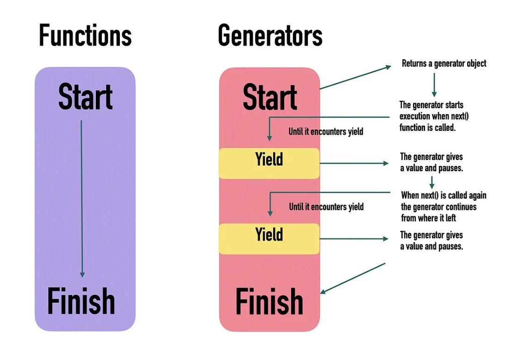

# ✨ What is a Generator Function in JavaScript?

A **generator function** in JavaScript is a special type of function that can be paused and resumed during runtime. Unlike normal functions, which run from start to finish, a generator function can yield multiple values over time, allowing the function to be paused at each `yield` keyword and resumed later, maintaining its context and state.

- **Syntax**: Defined with `function*` syntax and uses the `yield` keyword to produce a sequence of values.
- **Execution**: Each time the generator function is called (using `.next()`), it resumes from where it last paused, making it useful for handling sequences and asynchronous tasks.


---

# 🗓 When is a Generator Function Used?

Generator functions are useful in several scenarios:

- **Lazy Evaluation**: Generators allow for producing values only when requested, useful with large data sets or infinite sequences.
- **Asynchronous Programming**: Generators, in combination with `yield`, can serve as an alternative to promises or async/await for handling asynchronous code.
- **Iterators**: Generators simplify the implementation of custom iterators, enabling more control over the iteration process in complex data structures.

---

# 🚙 How is a Generator Function Used?

### 1. Syntax

- A generator function is declared with `function*` and uses the `yield` keyword to pause execution and return values to the caller.

   ```javascript
   function* myGenerator() {
       yield 1;
       yield 2;
       yield 3;
   }
   ```

### 2. Calling a Generator

- When you call a generator function, it returns an iterator object, not the final result. You can retrieve values by calling `.next()` on the iterator.

  - **`next()` Method**: Calling `.next()` on a generator object runs the function until the nearest `yield`, returning an object with:
    - `value`: The value yielded by the generator.
    - `done`: Boolean indicating if the function has completed execution.

   ```javascript
   const gen = myGenerator();
   console.log(gen.next()); // { value: 1, done: false }
   console.log(gen.next()); // { value: 2, done: false }
   console.log(gen.next()); // { value: 3, done: true }
   ```

### 3. Using `yield` with Expressions

- You can pass values back to the generator with `.next(value)`, which the generator receives as the result of the `yield` expression.

   ```javascript
   function* greeting() {
       const name = yield "What is your name?";
       yield `Hello, ${name}!`;
   }

   const gen = greeting();
   console.log(gen.next().value);          // "What is your name?"
   console.log(gen.next("Anish").value);   // "Hello, Anish!"
   ```

### 4. Generators are Iterable

- Generators can be iterated using `for..of` and other iterable methods. When iterating with `for..of`, the loop stops once `done: true`.
- **Spread Syntax**: You can expand generator values into an array using the spread syntax.

   ```javascript
   function* generateSequence() {
     yield 1;
     yield 2;
     yield 3;
   }

   console.log([...generateSequence()]); // [1, 2, 3]
   ```

### 5. Generator Composition (`yield*`)

- The `yield*` syntax allows a generator to delegate part of its execution to another generator, which is useful for combining sequences of values from different sources without storing them in memory.

   ```javascript
   function* generateSequence(start, end) {
     for (let i = start; i <= end; i++) yield i;
   }

   function* generateAlphaNum() {
     yield* generateSequence(48, 57);  // 0-9
     yield* generateSequence(65, 90);  // A-Z
     yield* generateSequence(97, 122); // a-z
   }
   ```

### 6. Stopping Generators with `return()`

- The `generator.return(value)` method stops the generator and returns the specified value, ending the generator immediately.

   ```javascript
   function* gen() {
     yield 1;
     yield 2;
   }

   const g = gen();
   console.log(g.next());         // { value: 1, done: false }
   console.log(g.return("done")); // { value: "done", done: true }
   ```

### 7. Using Generators for Asynchronous Code

- Although async/await is more common, generators can also handle asynchronous code when used with libraries like `co`.

---

# ✅ Pros and Cons

Note that async/await uses generator functions behind the scene.

### Pros

- **Memory Efficiency**: Generators produce values on-demand, which is memory-efficient for large or infinite sequences.
- **Controlled Execution**: Allows pausing and resuming, providing fine control over function execution.
- **Supports Asynchronous Code**: Can be used for async code and custom iterators.

### Cons

- **Complexity**: Can be harder to understand and use than async/await.
- **Limited Usage**: Async/await is generally preferred for handling asynchronous operations in modern JavaScript.

---

# 🔍 Follow-Up Interview Questions

Here are some follow-up questions an interviewer might ask after discussing generator functions:

1. **How do generator functions differ from regular functions and async functions?**
2. **Can you implement an infinite sequence using generator functions?**
3. **How can you handle errors in generator functions?**
4. **What are some real-world use cases where generator functions are still preferable over async/await?**
5. **How would you create a generator that produces values from two different arrays, alternating between them?**

> *💡 Trivia: Regular functions execute from start to finish sequentially. Once a function is invoked, it continues execution until it encounters either a return statement or reaches the end of the function body.*

## References

- [Generator Functions in JavaScript by Elshaday](https://elshaday.medium.com/generator-functions-in-js-25037e6afa16)

- [Javascript.Info : Generators](https://javascript.info/generators)
