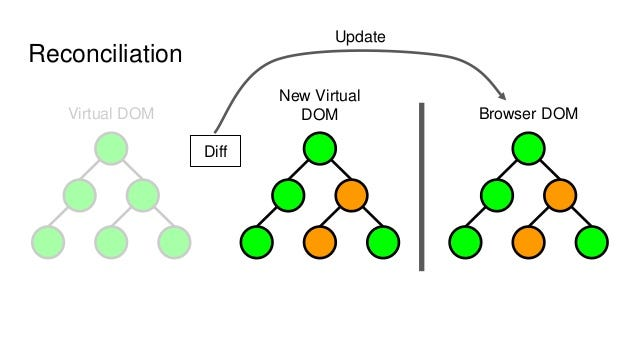
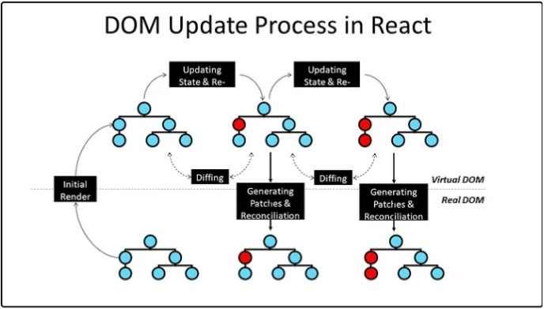

# Understanding the Virtual DOM in React: A Comprehensive Guide 🚀

As a **senior React developer**, having an in-depth understanding of the **Virtual DOM (VDOM)** is crucial. Not only does it help you write more efficient and optimized applications, but it also prepares you to answer advanced interview questions and contribute valuable insights in architectural discussions.

This article delves into the intricacies of the Virtual DOM, how it works, the problems it solves, its benefits and drawbacks, how it compares to the real DOM, and the improvements introduced in **React 18**, particularly with the **Fiber architecture**.

---

## Table of Contents

1. [What is the Virtual DOM?](#what-is-the-virtual-dom)
2. [How Does the Virtual DOM Work?](#how-does-the-virtual-dom-work)
3. [Benefits of the Virtual DOM](#benefits-of-the-virtual-dom)
4. [Problems Solved by the Virtual DOM](#problems-solved-by-the-virtual-dom)
5. [Pros and Cons of the Virtual DOM](#pros-and-cons-of-the-virtual-dom)
6. [Virtual DOM vs. Real DOM](#virtual-dom-vs-real-dom)
7. [React Internals: Reconciliation and Fiber Architecture](#react-internals-reconciliation-and-fiber-architecture)
8. [Improvements in React 18](#improvements-in-react-18)
9. [Preparing for Interview Questions](#preparing-for-interview-questions)
10. [Conclusion](#conclusion)

---
## Understanding the DOM

The Document Object Model (DOM) is a programming interface provided by web browsers. It represents the structure of a web page as a hierarchical tree of objects, allowing programming languages like JavaScript to interact with and manipulate the content, structure, and styles of a website dynamically.

---
## What is the Virtual DOM?

The **Virtual DOM** is an **in-memory representation** of the real DOM elements generated by React components before any changes are made to the web page. It is a lightweight copy of the actual DOM, enabling React to apply updates efficiently by minimizing direct manipulations of the real DOM.

In essence, the Virtual DOM is a **JavaScript object** that mirrors the structure of the real DOM. Whenever the state of a React component changes, a new Virtual DOM tree is created and compared with the previous one. This process is known as **reconciliation**.


---

## How Does the Virtual DOM Work?

The Virtual DOM operates through a series of steps:

1. **Rendering**: When a component's state or props change, React re-renders the component, generating a new Virtual DOM tree.

2. **Diffing Algorithm**: React compares the new Virtual DOM tree with the previous one using an efficient diffing algorithm. It identifies the minimal set of changes (also known as **patches**) needed to update the real DOM.

3. **Reconciliation**: Based on the differences identified, React updates the real DOM accordingly by applying these patches. This process minimizes the number of direct DOM manipulations, which are computationally expensive.

### Illustration of the Process:

```jsx
// Initial render
ReactDOM.render(<App />, rootElement);

// State change triggers re-render
setState({ value: newValue });

// React creates a new Virtual DOM tree
const newVDOM = render();

// React diffs the newVDOM with the oldVDOM
const patches = diff(oldVDOM, newVDOM);

// React applies the patches to the real DOM
patch(realDOM, patches);
```

---
## Benefits of the Virtual DOM

### 1. Performance Optimization 🚀

- **Minimized DOM Manipulations**: By calculating the minimal set of changes required, React reduces the number of DOM updates, leading to better performance.
- **Batch Updates**: React batches multiple state updates to avoid unnecessary re-renders.

### 2. Declarative UI 🎨

- Developers can describe how the UI should look at any given state, and React ensures the DOM matches that state.
- Simplifies the development process by abstracting away manual DOM manipulations.

### 3. Cross-Platform Rendering 🌐

- The concept of the Virtual DOM allows React to render components not just in the browser but also in environments like **React Native**, where the "real DOM" doesn't exist.

---

## Problems Solved by the Virtual DOM

### 1. Inefficient Direct DOM Manipulation 🐢

- **Problem**: Direct DOM operations are slow and can lead to performance bottlenecks, especially with frequent updates.
- **Solution**: The Virtual DOM minimizes direct DOM interactions by calculating efficient update paths.

### 2. Complexity in UI Updates 🧩

- **Problem**: Manually keeping the UI in sync with state changes is error-prone and complex.
- **Solution**: React's Virtual DOM abstracts this complexity, ensuring the UI reflects the current state without manual intervention.

### 3. Consistency Across Updates 🔄

- **Problem**: Managing UI consistency during asynchronous operations can be challenging.
- **Solution**: The Virtual DOM ensures that updates are applied consistently and in the correct order.

---

## Pros and Cons of the Virtual DOM

### Pros 👍

1. **Performance Efficiency**: Reduces unnecessary DOM manipulations.
2. **Developer Productivity**: Simplifies the coding process with a declarative approach.
3. **Cross-Platform Compatibility**: Facilitates rendering in different environments.
4. **Predictable UI Updates**: Ensures the UI consistently reflects the application state.

### Cons 👎

1. **Abstraction Overhead**: Additional layer can introduce complexity in understanding internals.
2. **Memory Usage**: Storing Virtual DOM trees consumes memory.
3. **Not Always Optimal**: For very simple applications, the overhead might not justify the benefits.
4. **Learning Curve**: Requires developers to understand the React rendering cycle.

---

## Virtual DOM vs. Real DOM

### **Virtual DOM**

- **Definition**: An in-memory representation of the real DOM.
- **Update Mechanism**: Uses diffing algorithms to compute the minimal changes required.
- **Performance**: Faster updates due to minimized DOM manipulations.

### **Real DOM**

- **Definition**: The actual Document Object Model rendered in the browser.
- **Update Mechanism**: Direct manipulation is slow and resource-intensive.
- **Performance**: Slower when frequent updates are required.

### **Key Differences**

- **Efficiency**: Virtual DOM updates are optimized; Real DOM updates can be inefficient.
- **Manipulation**: Virtual DOM changes are batch-applied; Real DOM changes happen immediately.
- **Abstraction**: Virtual DOM provides a higher-level abstraction over the real DOM.

---

## React Internals: Reconciliation and Fiber Architecture

### Reconciliation 🔄

- **Process**: React's algorithm for diffing between Virtual DOM trees and updating the real DOM.
- **Key Concepts**:
  - **Element Type Changes**: If an element changes from one type to another, React destroys the old one and creates a new one.
  - **Keys**: Used to identify elements in lists to optimize re-rendering.

### Fiber Architecture 🧵

Introduced in **React 16**, the Fiber architecture is a reimplementation of the core algorithm.

#### Objectives of Fiber:

1. **Incremental Rendering**: Ability to pause and resume work, making the UI more responsive.
2. **Prioritization**: Assign priority levels to updates (e.g., user interactions vs. data fetching).
3. **Better Error Handling**: Improved mechanisms to handle errors during rendering.

#### How Fiber Works:

- **Work Units**: Breaks rendering work into units called "fibers."
- **Scheduling**: Determines which fibers to process based on priority.
- **Concurrency**: Lays the groundwork for concurrent rendering features.

---

## Improvements in React 18

React 18 introduces significant enhancements that leverage the Virtual DOM and Fiber architecture.

### Key Improvements

1. **Concurrent Rendering** ⏳

   - **Description**: Allows React to prepare multiple versions of the UI at the same time.
   - **Benefit**: Improves performance by making rendering non-blocking.

2. **Automatic Batching** 📨

   - **Description**: Groups multiple state updates into a single re-render.
   - **Benefit**: Reduces unnecessary renders, improving efficiency.

3. **Suspense Enhancements** 🎣

   - **Description**: Improved support for data fetching with `Suspense`.
   - **Benefit**: Simplifies asynchronous rendering patterns.

### How React 18 Improves the Virtual DOM

- **Smarter Scheduling**: Better prioritization of rendering tasks, making use of the Virtual DOM more efficient.
- **Reduced Overhead**: Optimizations in the reconciliation process minimize the performance cost of maintaining the Virtual DOM.
- **Developer Experience**: New APIs that leverage the Virtual DOM for improved performance (e.g., `startTransition`).

---

## Preparing for Interview Questions

### 1. **What is the Virtual DOM in React, and how does it help?**

**Answer**:

The Virtual DOM is an in-memory representation of the real DOM elements generated by React components. It allows React to perform efficient updates by calculating the minimal set of changes required to update the real DOM. This helps improve performance by reducing direct DOM manipulations, which are costly operations.

**Key Points**:

- Lightweight copy of the real DOM.
- Enables efficient reconciliation and updates.
- Improves application performance.

### 2. **How does the Virtual DOM work? What benefits does it bring?**

**Answer**:

When a component's state or props change, React creates a new Virtual DOM tree and compares it with the previous one using a diffing algorithm. It then computes the minimal set of changes needed and updates the real DOM accordingly.

**Benefits**:

- **Performance Optimization**: Minimizes direct DOM manipulations.
- **Declarative UI**: Simplifies the development process.
- **Consistency**: Ensures UI is in sync with application state.

### 3. **What problem does the Virtual DOM solve?**

**Answer**:

It solves the inefficiency of direct DOM manipulation by abstracting and optimizing the update process. This addresses performance bottlenecks associated with frequent and complex DOM updates, providing a smoother user experience.

### 4. **Virtual DOM vs. Real DOM**

**Answer**:

- **Virtual DOM**: Efficient, in-memory representation, optimized updates, batch changes.
- **Real DOM**: Actual rendered elements in the browser, slower updates, immediate changes.

**Comparison**:

- Virtual DOM reduces the performance cost associated with real DOM manipulations.
- It provides a layer of abstraction that allows for declarative programming.

### 5. **How does React reconcile changes using the Virtual DOM and Fiber architecture?**

**Answer**:

React uses the reconciliation process to compare the new Virtual DOM with the old one, identifying changes. The Fiber architecture enhances this by breaking the rendering work into smaller units, allowing React to prioritize and schedule rendering tasks more effectively. This leads to better performance and responsiveness.

---

## Conclusion

Understanding the **Virtual DOM** is essential for advanced React development. It plays a pivotal role in how React optimizes updates and renders components efficiently. With the introduction of the **Fiber architecture** and improvements in **React 18**, the Virtual DOM continues to be a cornerstone of React's performance optimizations.

By grasping these concepts, you're better equipped to build high-performance applications and articulate the underlying mechanics during interviews or technical discussions.

---

## Additional Notes 📚

### Important Aspects Not to Miss

- **Keys in Lists**: Emphasize the importance of keys in list rendering for efficient diffing.
- **Avoiding Direct DOM Manipulation**: Discuss why manipulating the DOM outside of React (e.g., using jQuery) can lead to inconsistencies.
- **Custom Renderers**: Mention that React's architecture allows for custom renderers (e.g., React Native, React VR) because of the Virtual DOM abstraction.
- **Reconciliation Limitations**: Be aware of situations where React's reconciliation might not optimize updates effectively (e.g., when not using keys properly).

### Advanced Topics for Senior Developers

- **Concurrent Mode**: Deep dive into how React 18's Concurrent Mode works with the Virtual DOM to improve performance.
- **Scheduling and Prioritization**: Understand how React schedules tasks and how you can influence it using `useTransition` and `startTransition`.
- **Error Boundaries**: Explore how the Fiber architecture improved error handling in React components.
- **Performance Profiling**: Learn how to use React's DevTools Profiler to identify and optimize performance bottlenecks related to rendering.

---
**Resource Links :**
**https://medium.com/@itsanuragjoshi/mastering-react-understanding-real-dom-vs-virtual-dom-and-the-dom-update-process-78a233454ff8**

*Happy Coding!* 🎉